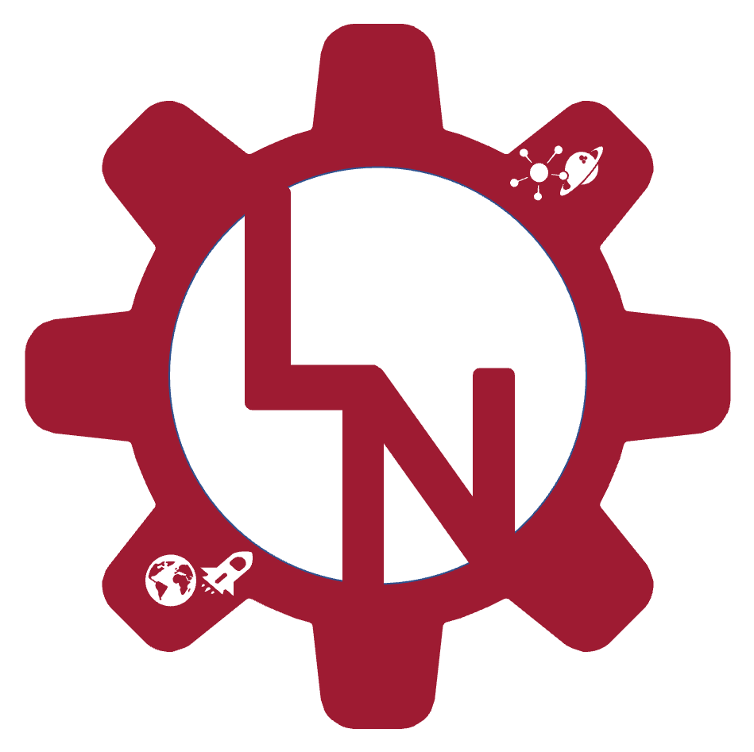

##  👋 Hello! My name is Liam. Welcome to my Educational Repo! 

<h5> Check out my website by clicking on the logo! </h5>

  <a href="https://liamnester.github.io/" </a>

---

### Purpose

This Org serves as a platform to allow me to demonstrate the solutions and implementations of both simple and complex engineering problems. I have (and am always working on) several repos discussing:

- Advanced mathematics
- Fluids and heat transfer
- Signal processing and simulation
- Space propulsion
- ....and more!

---

Check out some of the Educational Repos I have made...

1) [Solution and Expansion of an Eigenvalue Problem](https://github.com/LiamNesterEducational/ExpansionOfAnEigenvalueProblem)
2) [Creating an N-bit Data Aquisition (DAQ) System](https://github.com/LiamNesterEducational/CreatingAnNBitDataAqSystem)
3) [The Collatz Conjecture](https://github.com/LiamNesterEducational/CollatzConjecture)

Stay tuned for more!

---

### Connect with me:

[][website]
[][linkedin]

[website]: https://liamnester.github.io/
[linkedin]: https://www.linkedin.com/in/liamnester/
